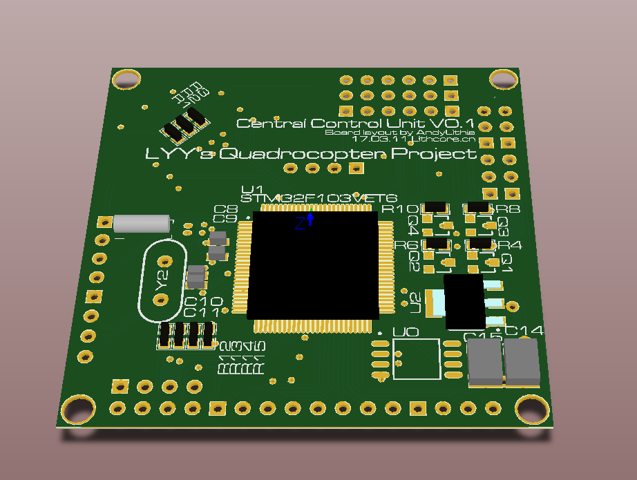

## Mustard: Light AutoPilot for ARM Cortex-M3
- Author: Liu-Yinyi
- Date: 2017-04-03
- Version: 2.0.3
- Abstract: BoardLayout(**Altium Designer**), McuCode(**Keil**)

---

### Introduction
It is an awkward project finished when I was a freshman of my university life.     
There might be something wrong in this project. Any questions could attach issue.



-

### Dependencies
Required softwares:

> 1. **Altium Designer** 2017 or Higher Version
> 2. **Keil MDK** V5.00 or Higher Version

-

### Project Brief

#### - Details of Directories
`BoardLayout` is related to the PCB Project.    
`McuCode` is related to the Keil Project.

```
├── BoardLayout
│   ├── PCB.PcbDoc
│   └── Scheme.SchDoc
│
└── McuCode
    ├── Control
    ├── DebugConfig
    ├── Driver
    ├── Listings
    ├── Math
    ├── Mustard
    ├── Objects
    ├── README
    ├── RTE
    ├── User
    └── mustard.uvprojx
```


#### - Details of Platform
It is targeted to `STM32F103VET6`.     
You can transfer to other platform easily because I use C++.